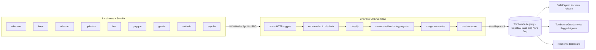

# 🪦 Tombstone SG: a "Restriction Order" for wallets

A graduated, on-chain restriction order for self-custody wallets. When a scam victim's wallet is taken over
by an EIP-7702 sweeper delegation, a Chainlink CRE workflow detects it across chains, reaches DON consensus,
and writes a contract-readable flag that payroll and Safe multisigs honour — escrowing (never confiscating)
funds bound for the compromised wallet.

**Track:** Chainlink CRE (main) + NOWNodes Multichain (secondary) · **Builder:** Haziq ([@mhrk04](https://github.com/mhrk04)) · **Cost:** $0 · **License:** MIT

## The problem (every figure sourced in [`docs/sources.md`](docs/sources.md))
- 2025: 37,308 scam cases, **S$913.1M** lost; crypto **S$182.2M** (~20%).
- Victims are coaxed to share "login details and seed phrases… full control over the victims' accounts."
- Gov-official impersonation scams rose **123.6%** to 3,363 cases (S$242.9M).
- The **Protection from Scams Act 2025** lets police issue Restriction Orders — **to banks**. 12 ROs by 15 Feb 2026; MHA notes "significant system changes are required to allow for graduated restrictions."
- **Our reading:** ROs don't reach self-custody wallets. Attacker-side screens pass a victim's address because it looks clean — the compromise lives in the 7702 delegation, not the address.
- **>97%** of 7702 delegations used one copy-pasted "CrimeEnjoyor" sweeper; ~79,000 addresses authorised. WazirX lost ~US$230M from a Safe; Phemex >US$85M across 16 chains.

## Architecture


## State machine
`NONE → SUSPECT → TOMBSTONED → CLEARED`. Never downgrades a tombstone. CLEAR needs `cleanStreak ≥ minCleanScans`.
No wallet can clear its own flag with its own key. Stale observations are ignored. See [`docs/design.md`](docs/design.md).

## Key finding
Sweeper copies embed different thief addresses, so their code hashes differ. Zeroing the PUSH20 operands
gives ONE **skeleton hash** that catches the family. See [`docs/spike-log.md`](docs/spike-log.md).

## Repo layout
```
contracts/     Foundry (solc 0.8.37, evm_version prague, via_ir OFF) — registry, payroll, guard, scripts, 16 tests
cre-workflow/  CRE TS workflow (cron+HTTP, consensus, 3-testnet write), 20 tests
scanner/       Bun+viem 7702 detection library + CLI, 8 tests (classify.ts/codeReader.ts shared byte-identically)
app/           read-only Vite 7 + React 19 dashboard
docs/          design, sources, demo-script, spike-log, tasks
```

## Quickstart
```bash
git clone --recursive https://github.com/mhrk04/tombstone-sg
cd tombstone-sg
cp .env.example .env            # fill throwaway TESTNET keys + NOWNodes key
make install && make test       # forge 16/16 · workflow 20/20 · scanner 8/8 · app build
make wasm                       # cre workflow build (needs the CRE CLI)
```

## What you run after login (needs funded testnet keys — I don't broadcast for you)
```bash
set -a; source .env; set +a
cd contracts
forge script script/Deploy.s.sol --rpc-url sepolia          --broadcast --private-key $PRIVATE_KEY
forge script script/Deploy.s.sol --rpc-url base_sepolia     --broadcast --private-key $PRIVATE_KEY
forge script script/Deploy.s.sol --rpc-url arbitrum_sepolia --broadcast --private-key $PRIVATE_KEY
TAN=$TAN_ADDRESS BOB=$BOB_ADDRESS CAROL=$CAROL_ADDRESS \
  forge script script/DemoSetup.s.sol --rpc-url sepolia --broadcast --private-key $PRIVATE_KEY
cd ..
# paste contracts/deployments/{11155111,84532,421614}.json .registry into
# cre-workflow/scan/config.staging.json targets[]; set watchlist; fill app/.env.local
cd cre-workflow
cre workflow simulate ./scan --target staging-settings --env ../.env --non-interactive --trigger-index 0
cre workflow simulate ./scan --target staging-settings --env ../.env --non-interactive --trigger-index 0 --broadcast
```
Check: `cast call <registry> "getForwarderAddress()(address)"` equals the MockForwarder on each chain;
`cast call <registry> "statusOf(address)(uint8)" $TAN_ADDRESS`.
Deploy to the DON is NOT possible yet (Deploy Access not enabled; request via `cre account access`).
Before `cre workflow deploy ./scan --target production-settings`, fill `httpAuthorizedKeys` in `config.production.json`.
Full runbook + fallback (if CRE is unavailable): [`docs/demo-script.md`](docs/demo-script.md).

## Track fit
| Chainlink CRE | NOWNodes |
|---|---|
| cron + HTTP triggers · HTTPClient node mode · secrets · `consensusIdenticalAggregation` · `runtime.report` · `writeReport` to 3 testnets · ReceiverTemplate | batched `eth` + `eth-sepolia` with config-driven keyed chains and 404/429 → public fallback |

## Honest status
| | |
|---|---|
| ✅ | forge **16/16** (real 7702 sweep, real Safe v1.4.1 guard revert) |
| ✅ | workflow **20/20** + typecheck against @chainlink/cre-sdk 1.23.0; `classify.ts`/`codeReader.ts` byte-identical to scanner |
| ✅ | scanner **8/8**; live read-only scan across 8 mainnets, keyless, deployless |
| ✅ | app typecheck + build (demo + live) |
| ⛔ | `--broadcast` until a funded testnet key exists · `cre workflow deploy` until Deploy Access enabled |
| ⛔ | `cre workflow build/simulate` not run here (CRE CLI is a human install step) |
| ✅ | partial-NOWNodes handling (free key = eth + eth-sepolia only) |
| ❓ | chainId-0 replay on testnets · 7702 on Base/Arb Sepolia · live Safe on Sepolia (unverified) |
| 🔜 | Safe live demo · a Run-payroll button · OBS_CLEAR emission from the workflow |
| ⚠️ | a small allowlist makes SUSPECT noisy on mainnet |

## Placeholders to replace before a live demo
`config.staging.json` `targets[].registry` (`0x…0001`), the `watchlist`, and `app/.env.local` addresses;
the deployed addresses + real tx hashes in this README after you broadcast.

## Security notes
`onReport` is forwarder-only; set `expectedAuthor`/`workflowId` in production. The v1 watchlist is public.
Never put real victim addresses in configs. **Not endorsed by MAS, SPF, or any bank.** All code here is a
hackathon reference implementation and needs an AppSec review before any production use.

## Roadmap
v2: sweep heuristics beyond 7702, Tron USDT, a Safe module (not just a guard), field aggregation to beat
delegation flap, and a permissioned write path for real issuers.
